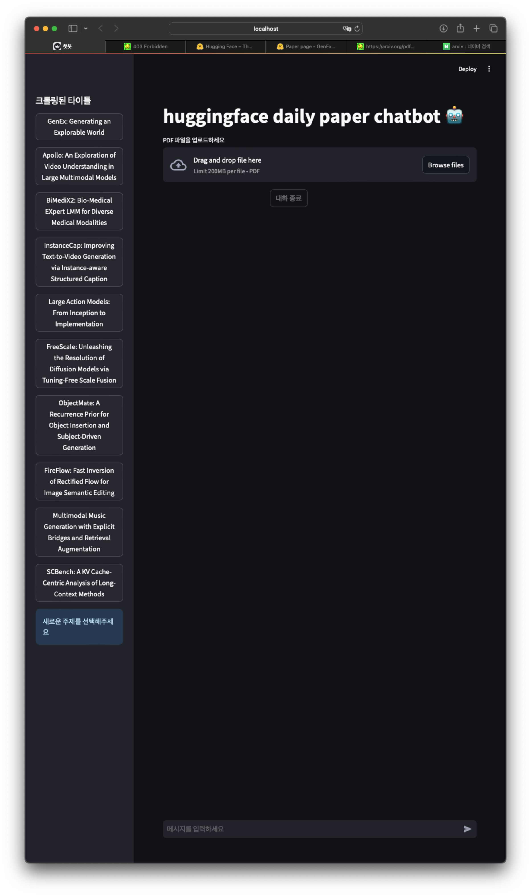
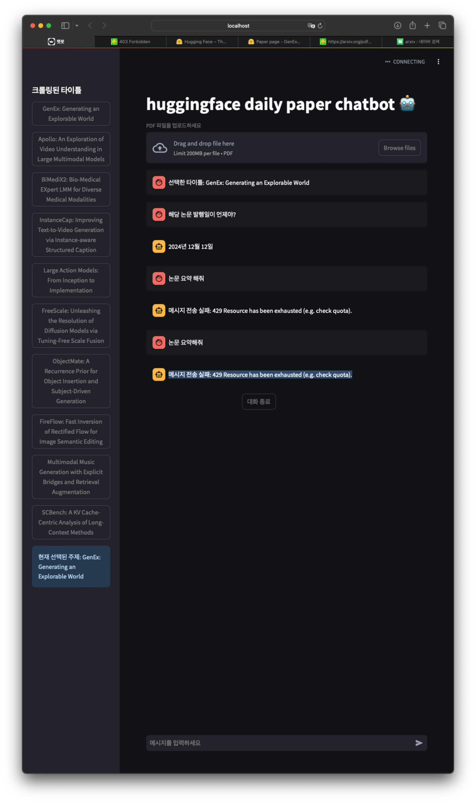

# HuggingFace Daily Papers Chatbot 🤖

HuggingFace에서 매일 업데이트되는 논문들을 크롤링하고, 해당 논문들에 대해 AI 챗봇과 대화할 수 있는 웹 애플리케이션입니다.

## 주요 기능

- HuggingFace 논문 자동 크롤링
- PDF 논문 다운로드 및 텍스트 추출
- Gemini Pro API를 활용한 대화형 챗봇
- Streamlit 기반의 사용자 친화적 인터페이스

## 시작하기

### 필수 요구사항

- Python 3.7 이상
- Gemini API 키
- 필요한 Python 패키지:
  - streamlit
  - google.generativeai
  - PyPDF2
  - beautifulsoup4
  - selenium
  - requests
  - python-dotenv

### 설치 방법

1. 저장소 클론
```bash
git clone https://github.com/hojuna/DailyPapers_chatBot.git
```
2. 설치
```bash
pip install -r requirements.txt
```
3. 실행
```bash
streamlit run main.py
```





## 사용 방법

1. 웹 인터페이스에 접속하여 Gemini API 키를 입력합니다.
2. 사이드바에서 원하는 논문을 선택합니다.
3. 선택한 논문에 대해 AI 챗봇과 대화를 시작합니다.
4. 필요한 경우 직접 PDF 파일을 업로드하여 분석할 수도 있습니다.

## 프로젝트 구조

- `main.py`: Streamlit 웹 애플리케이션 메인 파일
- `crawl.py`: HuggingFace 논문 크롤링 관련 코드
- `ai_api.py`: Gemini API 연동 및 챗봇 기능 구현

## 주의사항

- Gemini API 키가 필요합니다.
- 인터넷 연결이 필요합니다.
- PDF 파일은 자동으로 'papers_pdf' 디렉토리에 저장됩니다.

## 라이선스

이 프로젝트는 MIT 라이선스를 따릅니다.